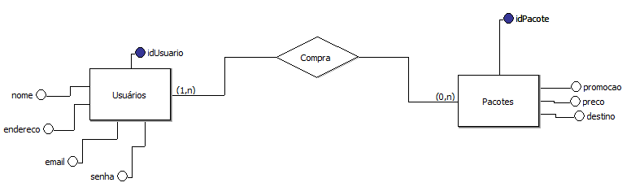
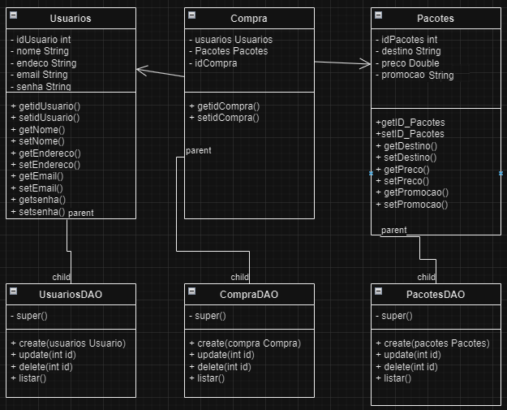

## Entrega do segundo projeto individual, Módulo 3, do Recode Pro 2023

# Clique aqui para ver o site hospedado no Git Pages 

<h1><a href="https://anaclara-amorim.github.io/ProjetoRecodeProModulo3/Front-End/PrototipoSite/index.html" target="_blank">Habilitado com Git Pages</a></h1>

## Este projeto contou com a elaboração de Modelos de banco de dado, conceitual, lógico e físico, abaixo estão as imagens dos modelos:

# Modelo conceitual

# Modelo físico

# Modelo lógico

## Além da parte da modelagem de dados e front-end, houve a parte do back-end, que começou com a elaboração de uma UML, abaixo está a imagem:

